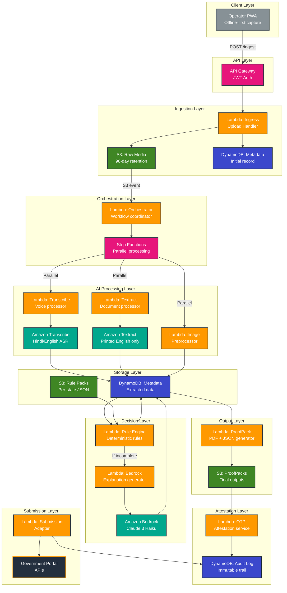

# ProofPack AWS Architecture Diagram (Mermaid)

This diagram will render automatically on GitHub, VS Code with Mermaid extension, and many other markdown viewers.

## How to View This Diagram

1. **On GitHub**: Push this file to your repo and view it - GitHub renders Mermaid automatically
2. **In VS Code**: Install the "Markdown Preview Mermaid Support" extension
3. **Online**: Copy the mermaid code block to https://mermaid.live/

## Architecture Flow Summary

1. **Operator PWA** → API Gateway → Lambda Ingress → S3 Raw Media + DynamoDB
2. **S3 Event** → Lambda Orchestrator → Step Functions (parallel processing)
3. **Parallel AI Processing**:
   - Transcribe Lambda → Amazon Transcribe → DynamoDB
   - Textract Lambda → Amazon Textract → DynamoDB
   - Image Preprocessor → DynamoDB
4. **Rule Engine** loads per-state rules from S3 → evaluates → DynamoDB
5. **Bedrock Lambda** (if needed) → Amazon Bedrock → explanation → DynamoDB
6. **ProofPack Generator** → creates PDF + JSON → S3 Final
7. **OTP Attestation** → validates operator → DynamoDB Audit Log
8. **Submission Adapter** → Government Portal APIs + Audit Log

## Key Components

- **Orange**: Lambda functions (compute)
- **Green**: S3 buckets (storage)
- **Blue**: DynamoDB tables (database)
- **Teal**: AI/ML services (Transcribe, Textract, Bedrock)
- **Pink**: Integration services (API Gateway, Step Functions)
- **Gray**: Client (Operator PWA)
- **Dark**: External systems (Government Portal)
