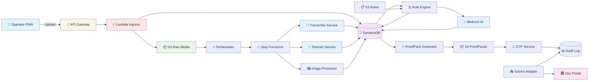
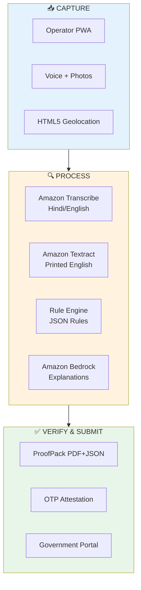
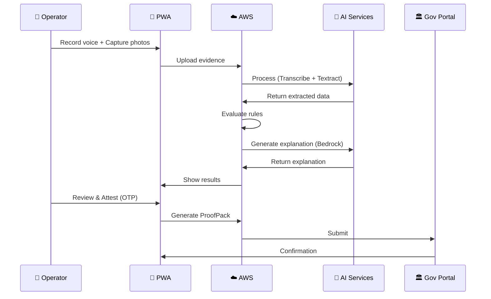

# ProofPack Simple Flow Diagram

## Simplified 3-Stage View

## Data Flow with Emojis

## Component Icons Legend

- 👤 = User/Operator
- 📱 = Mobile PWA
- 🚪 = API Gateway
- ⚡ = Lambda Functions
- 📦 = S3 Storage
- 💾 = DynamoDB
- 🔄 = Step Functions
- 🎤 = Transcribe (Voice)
- 📄 = Textract (OCR)
- 🖼️ = Image Processing
- ⚖️ = Rule Engine
- 🤖 = AI/Bedrock
- 📑 = ProofPack Generator
- 🔐 = OTP/Security
- 📊 = Audit Logs
- 🏛️ = Government Portal
- ☁️ = AWS Cloud

## View Instructions

These diagrams render automatically on:
- ✅ GitHub (just view the file)
- ✅ VS Code (with Mermaid extension)
- ✅ GitLab
- ✅ Notion
- ✅ https://mermaid.live/ (paste the code)
